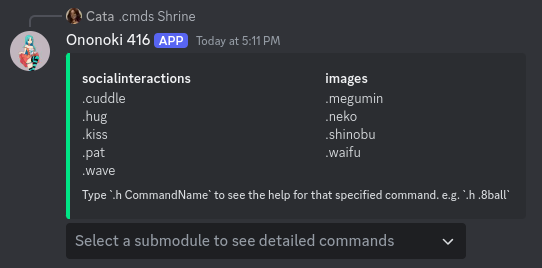

# NorthShirahebi
## A Medusa module for [NadekoBot](https://gitlab.com/kwoth/nadekobot)!
Make your own https://nadekobot.readthedocs.io/en/latest/medusa/creating-a-medusa/

### This Medusa pulls images from [waifu.pics](https://waifu.pics/)



## Installation
1. Open you terminal and navigate outside of your nadekobot folder
    ```bash
    curl -s https://github.com/cataclym/NorthShirahebi/releases/latest/download/NorthShirahebi.tar.gz \
   | tar xvf - -C nadekobot/output/data/medusae/NorthShirahebi
    ```
2. Start your bot
3. Run .meload NorthShirahebi
